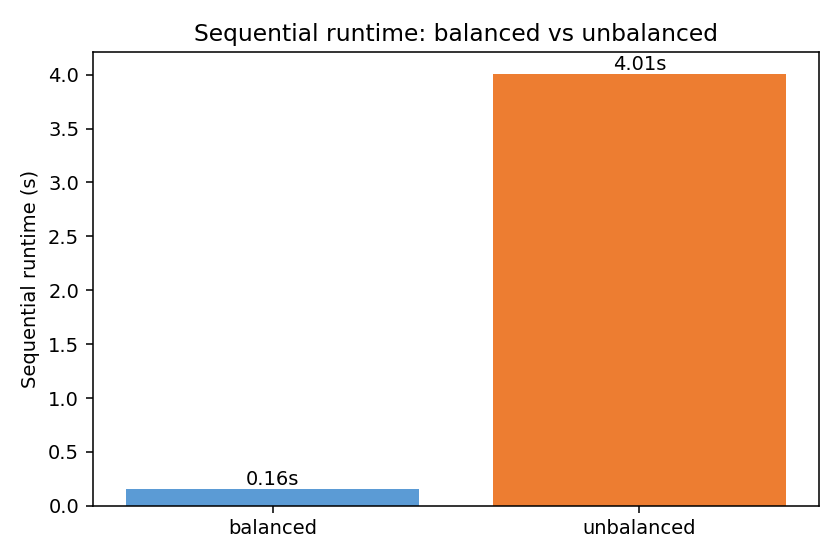
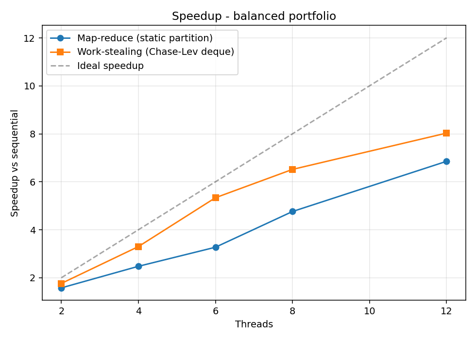
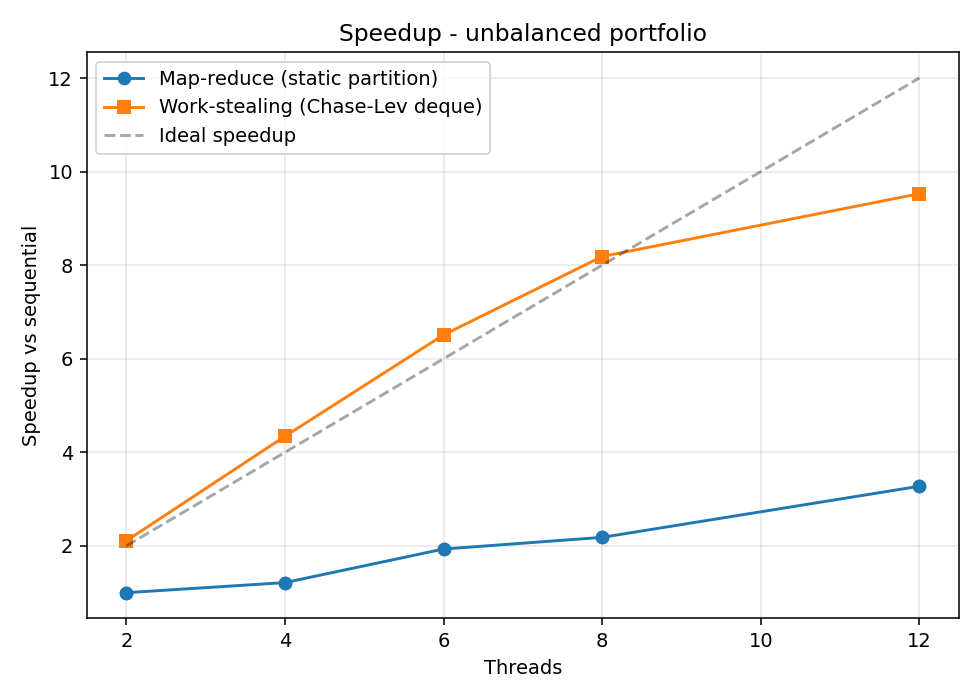
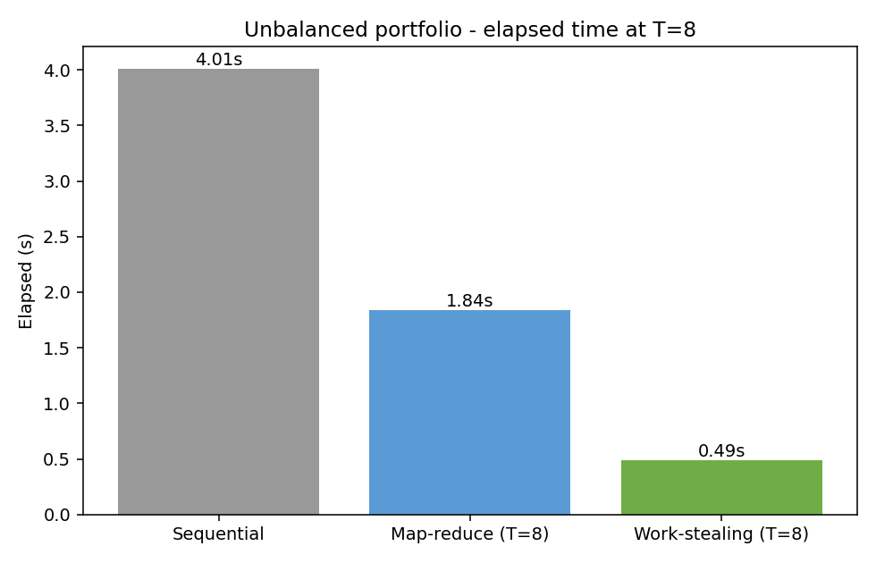
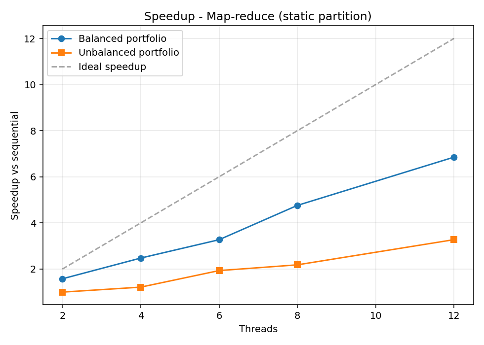
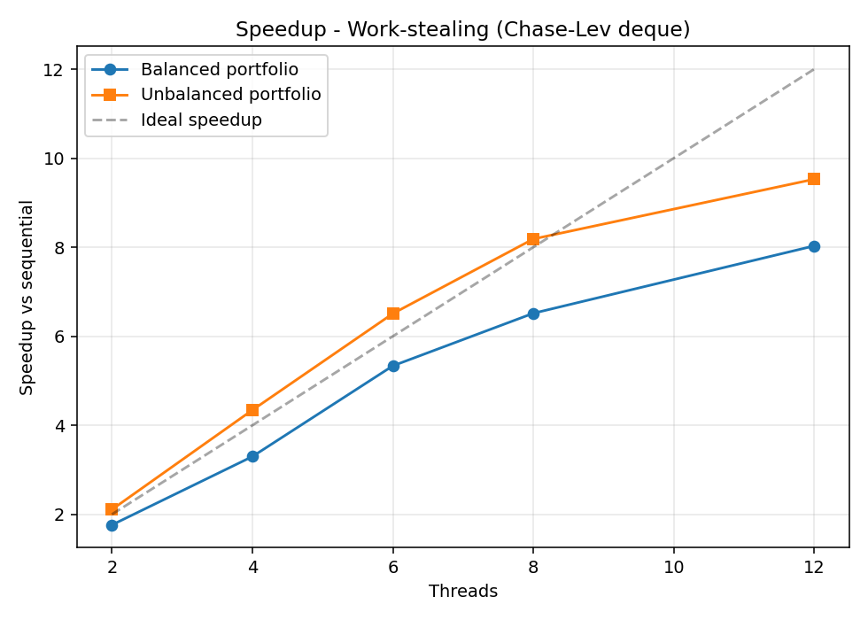

# Project 3 — Parallel Monte Carlo Option Pricer

Enrico Pioppi
CMSC 22360 — Parallel Programming

---

## 1. Problem

The project prices a **portfolio of options** by Monte Carlo. For each
option in the input portfolio, the system simulates many sample paths
of the underlying asset under geometric Brownian motion, evaluates the
option's payoff on each path, averages the payoffs, and discounts back
to present value. The portfolio total is the sum across all options.

Three option types are supported:

| Option type           | Payoff                              | Per-path work                                         |
|-----------------------|-------------------------------------|-------------------------------------------------------|
| European call         | `max(S_T - K, 0)`                   | One normal draw (sample `S_T` directly under GBM)     |
| Asian (arith-avg) call| `max(mean(S_t) - K, 0)`             | Step through the full path (M timesteps)              |
| American put          | `max(K - S_t*, 0)` at optimal `t*`  | Step through the full path + least-squares regression |

The three types differ by roughly **two orders of magnitude in per-option
work**: European pricing is one normal draw per path; Asian needs a path
of M≈100 steps; American needs a path *plus* a backward induction with a
regression at every in-the-money node. This wide cost spread is the
reason work-stealing matters for this problem: a portfolio with a mix
of types is the "items of vastly different sizes" case the assignment
brief calls out.

The system reads a portfolio (JSON), prices each option via Monte
Carlo, and writes timing rows to a CSV. Three execution modes are
selectable via a CLI flag.

## 2. How the parallel solutions are implemented

### 2.1 Why map-reduce

Pricing one option is independent of every other option. There are no
inter-option dependencies, no streaming pipeline stages, and no need
for multiple rounds of synchronization. **Map-reduce** with a single
barrier between map and reduce is the simplest pattern that fits:

  - **Map:** apply the pricer to each option independently and write
    the result into a pre-allocated slice.
  - **Barrier** (sync.Cond): every map task finishes before the reduce
    starts.
  - **Reduce:** sum the per-option prices.

BSP and pipelining would force structure where the problem doesn't
need any. Map-reduce keeps the implementation small and lets the
reduce step (200 floating-point additions) stay trivial.

**Latency vs throughput.** The two parallel runners optimise for
different things. Map-reduce has effectively zero per-task overhead
(workers run a tight loop over their slice) but pays one global
barrier wake-up at the end, so it maximises *throughput* on a balanced
workload where every worker finishes at roughly the same time. The
moment workloads diverge, however, map-reduce's wall-clock latency is
gated by the *slowest* worker — the barrier won't release until that
worker is done. Work-stealing inverts the trade-off: each task pop
costs a pair of atomic operations, but no worker is ever stuck idle
while another has unfinished work. So work-stealing trades a small
constant per-task cost for a much lower tail latency on uneven
workloads, which is exactly the regime this portfolio lives in.

### 2.2 Sequential baseline (`runner/sequential.go`)

One goroutine loops over the portfolio and calls the type-dispatched
pricer for each option. This is the reference: the parallel runners
must produce the same per-option prices (and therefore the same
portfolio total) when given the same seed.

### 2.3 Basic parallel: static-partition map-reduce (`runner/mapreduce.go`)

`T` worker goroutines each receive a contiguous slice of the options
array of size `⌈n/T⌉`. Each worker prices its slice and writes results
into disjoint indices of the shared results slice — no contention, no
locks. Every worker, plus the main goroutine, then calls
`Barrier.Wait()` (T+1 participants). When the barrier opens, the main
goroutine performs the reduce.

The barrier is implemented in `barrier/barrier.go` as `sync.Mutex` +
`sync.Cond` with a generation counter for reuse, following the
condition-variable barrier pattern from class. (I could have used
`sync.WaitGroup` for the same effect, but the assignment specifically
asks for a `sync.Cond` barrier here.)

The static partition is deliberately simple — and that simplicity is
what motivates the work-stealing runner. With the unbalanced portfolio
(Europeans grouped first, then Asians, then Americans), the last
worker(s) get the heavy options while the first finish their cheap
Europeans in milliseconds and wait at the barrier.

### 2.4 Work-stealing (`runner/steal.go` + `deque/deque.go`)

Each of the `T` worker goroutines owns its own **array-based lock-free
deque**. Tasks are distributed round-robin at startup so that heavy
options are spread across all deques rather than all landing on the
last one. Each worker loops:

  1. Try to pop a task from its **own deque's bottom** (LIFO).
  2. If empty, pick a random victim and try to steal from the **top**
     of that victim's deque (FIFO).
  3. If the global `remaining` counter hits zero, exit.
  4. Otherwise yield (`runtime.Gosched()`) and retry.

The deque is **lock-free** (the assignment's main requirement for this
part): all synchronization is done with `sync/atomic` operations on
`top` and `bottom`, no mutex anywhere. The owner's `PushBottom` and
the uncontended branch of `PopBottom` need only atomic loads/stores.
Only the one-element edge case — where the owner and a thief race for
the last item — needs a `CompareAndSwap` on `top`.

Per-option task granularity (one task = one option) is chosen because
the variance in cost between option types is already large enough that
finer subdivision (per-path chunks) wouldn't help much in practice for
this portfolio. Per-path chunks are mentioned in §10 as the natural
next step if the portfolio had fewer but more expensive options.

### 2.5 Per-task RNG determinism (`option/rng.go`)

Each task constructs its own `XorShift64` PRNG seeded from
`seed XOR (taskIndex+1) · 0x9E3779B97F4A7C15`. There is no shared RNG
state, so threads never have to coordinate on the RNG. The same global
seed produces the same per-option prices regardless of mode or thread
count, which makes correctness comparisons across runners trivial.

## 3. Challenges

**What I wanted to learn.** Going in, I wanted to find out two things:
(a) whether work-stealing's textbook advantage actually shows up in
wall-clock numbers when per-task cost varies by ~100× — or whether
constant overheads eat the win at small portfolio sizes; and (b) what
it actually takes to implement a lock-free deque correctly from the
paper, rather than reaching for a library. Both questions ended up
answered (yes, and "more than I expected") and shape the discussion
below.

**Deque correctness.** Getting the one-element edge case right
took some thought. When the deque holds exactly one task, the owner's
`PopBottom` and a thief's `Steal` both target the same slot; the
algorithm settles the race with a `CompareAndSwap` on `top`. Go's
`sync/atomic` provides sequentially-consistent semantics, so I didn't
need to add explicit memory fences. The deque has a `-race`-clean
stress test that runs one owner against multiple thieves over 50,000
tasks.

**Deterministic prices across runners.** Per-task RNG seeding (rather
than a shared global RNG) was the cleanest way to make seq / par /
steal produce identical numbers. A shared RNG would have either needed
locking (killing scalability) or made prices depend on thread count
(defeating correctness checks).

**Dataset layout.** A sorted layout (Europeans → Asians → Americans)
produces a clear gap between static partitioning and work-stealing for
the writeup; a shuffled portfolio would still show work-stealing
winning, just by a smaller margin. I went with sorted for the
demonstration.

**Termination detection.** A general work-stealing termination
protocol is tricky (a worker can be "idle" while a victim is about to
push more work). Because the runner here only pushes during init, I
could simplify termination to an atomic `remaining` counter that hits
zero exactly when all tasks have been processed.

## 4. Correctness check

All three runners agree on every portfolio total, byte for byte. Two
representative seeds:

```
seed=42
mode=seq   threads=1  dataset=balanced    elapsed=162ms   total=2843.7070
mode=par   threads=8  dataset=balanced    elapsed=27ms    total=2843.7070
mode=steal threads=8  dataset=balanced    elapsed=23ms    total=2843.7070
mode=seq   threads=1  dataset=unbalanced  elapsed=4021ms  total=2597.5307
mode=par   threads=8  dataset=unbalanced  elapsed=1796ms  total=2597.5307
mode=steal threads=8  dataset=unbalanced  elapsed=485ms   total=2597.5307

seed=100
mode=seq   threads=1  dataset=balanced    elapsed=157ms   total=2841.1003
mode=par   threads=8  dataset=balanced    elapsed=42ms    total=2841.1003
mode=steal threads=8  dataset=balanced    elapsed=24ms    total=2841.1003
mode=seq   threads=1  dataset=unbalanced  elapsed=4117ms  total=2595.0268
mode=par   threads=8  dataset=unbalanced  elapsed=1925ms  total=2595.0268
mode=steal threads=8  dataset=unbalanced  elapsed=469ms   total=2595.0268
```

The same byte-for-byte agreement holds for every cell in the full 5-seed
sweep — portfolio totals reproduce across thread counts, modes, and
machines because of the per-task RNG seeding scheme (§2.5).

A separate Go test (`option/european_test.go`) prices an at-the-money
European call by Monte Carlo and asserts the result lies within 3
standard errors of the Black-Scholes closed form — a 99.7% confidence
check on the pricer itself.

As an extra sanity check, the European Monte Carlo pricer was compared
to the Black-Scholes closed form for a simple case (`spot=100, K=100,
r=0.05, sigma=0.2, T=1`): the pricer returns about 10.39, vs the
analytical value 10.45 — within about 1.2 standard errors of the MC
estimate.

## 5. Experimental results

All experiments use 200-option portfolios.

  - **Balanced**: 200 European calls. Per-option cost is roughly
    uniform.
  - **Unbalanced**: 140 European + 40 Asian + 20 American, grouped in
    that order. The 30% non-European options account for almost all
    the compute.

Numbers below are from the **`fe.ai.cs.uchicago.edu` Peanut cluster**,
`peanut-cpu` partition (AMD EPYC 9124, 16 physical cores allocated
per job, Go 1.19.13 installed in `$HOME/go` per the project's cluster
notes, Linux). The job is submitted as
`sbatch benchmark/benchmark-proj3.sh`, which sets up the environment
and invokes `scripts/cluster_experiments.sh` to sweep five RNG seeds
(42, 100, 7, 1234, 9999). Every table cell below is the mean of those
five runs.

Cross-seed dispersion is tight on the unbalanced workload (median
coefficient of variation 3.3%, max 5.8%) and looser on the balanced
workload (median 6.7%, max 19.5%) — the latter because individual
balanced runs at high `T` finish in 20–40 ms, where OS scheduling
jitter is a meaningful fraction of wall-clock time. None of the
qualitative comparisons below change if a worst-case run replaces
the mean.

### 5.1 Sequential runtime

| Dataset    | Time (s) |
|------------|----------|
| balanced   | 0.16     |
| unbalanced | 4.01     |

The 25× gap confirms that "unbalanced" really does concentrate the work.



### 5.2 Speedup, balanced portfolio

| Threads | Map-reduce | Work-stealing |
|---------|-----------:|--------------:|
| 2       |       1.58 |          1.76 |
| 4       |       2.48 |          3.30 |
| 6       |       3.27 |          5.34 |
| 8       |       4.76 |          6.52 |
| 12      |       6.85 |          8.03 |

Both modes scale on the balanced portfolio, with work-stealing
consistently a step ahead. The gap (e.g. 4.76× vs 6.52× at T=8) is
small in absolute terms — the balanced runs finish in 25–40 ms total,
so the barrier wake-up cost on the map-reduce side is a non-trivial
fraction of that tiny budget. Work-stealing has no global barrier:
each worker exits as soon as the atomic `remaining` counter hits zero,
which on a balanced workload happens at roughly the same moment for
everyone. Once the absolute runtime grows (the unbalanced case in
§5.3), this constant-overhead gap stops mattering and the load-balancing
advantage takes over.



### 5.3 Speedup, unbalanced portfolio

| Threads | Map-reduce | Work-stealing |
|---------|-----------:|--------------:|
| 2       |       1.00 |          2.11 |
| 4       |       1.22 |          4.34 |
| 6       |       1.93 |          6.51 |
| 8       |       2.18 |          8.18 |
| 12      |       3.27 |          9.53 |

On the unbalanced portfolio, the two modes diverge sharply. At **T=2**
the static partition gets almost no speedup (1.05×): the second worker
inherits the entire Asian + American workload while the first finishes
its slice of cheap Europeans in milliseconds and waits at the barrier.
Work-stealing at T=2 gets 2.13× — slightly **super-linear** vs the
single-thread baseline because the two workers cooperatively price the
expensive options sooner, hiding some of the per-call allocation
pressure that the lone sequential worker pays back-to-back.

At T=8 the gap is **2.18× vs 8.18×** — work-stealing is about **3.8×
faster wall-clock** than static partitioning. At T=12 the gap widens to
3.27× vs 9.53×: work-stealing continues to scale past the 8-physical-core
boundary thanks to SMT, while static partitioning's gain comes mainly
from the heaviest workers each owning fewer expensive options as T
grows (and is still bottlenecked by whichever worker drew the
Americans).





### 5.4 Per-implementation speedup

The plots above overlay both implementations on a single chart so the
two are easy to compare side-by-side. The plots below isolate one
implementation per chart so each parallel implementation has its own
explicit speedup graph (with the two datasets overlaid).





## 6. Hotspots and bottlenecks

**Hotspots (parallelizable):**

  - Asian pricer inner loop — per-path step-by-step path simulation,
    O(P · M) for P paths and M timesteps. Trivially parallel across
    options.
  - American pricer — forward path generation plus a backward
    induction with a least-squares regression at each in-the-money
    node. Heaviest per-option workload by a wide margin. Parallel
    across options.

**Bottlenecks (irreducibly sequential):**

  - JSON portfolio load at startup (a few ms; negligible).
  - The final reduce — 200 float adds, sub-millisecond.
  - The path simulation inside any single option is sequential because
    the GBM step at time `t` depends on the price at time `t-1`. With
    60 medium/heavy options spread across 12 threads, there's still
    plenty of parallelism overall, but a portfolio with only a handful
    of very heavy options would expose this as a real limit. Per-path
    subdivision (§10) is the natural next step there.

The system parallelizes the hotspots fully — no contended shared
state or lock sits in the inner loop. The remaining bottleneck on the
unbalanced portfolio is **load imbalance between threads**, which is
exactly the problem work-stealing addresses (§7).

A few small optimizations matter for this workload:

  - **American pricer:** a single flat `[]float64` buffer is used for
    all paths instead of `[][]float64`, cutting per-call allocations
    from O(P) to O(1) and reducing GC pressure when several American
    pricers run on different goroutines.
  - **American pricer:** the per-timestep discount factors are
    precomputed once into a small array, replacing the inner-loop
    `math.Pow` calls with array lookups.
  - **Deque cache padding:** the `top` and `bottom` atomics
    sit on separate 64-byte cache lines (`deque/deque.go`). Without
    that padding the two atomics share a line, and every `Steal()`
    invalidates the line on the owner's core. An A/B comparison on
    the cluster (one cluster run with the padding removed, one with
    it back in, same Go version and CPU allocation) showed the
    padding shaving about 4% off the unbalanced T=8 work-stealing
    run, at zero cost in code size.

## 7. Did work-stealing improve performance? Why?

Yes, by a lot on the unbalanced portfolio. At T=8 the work-stealing
runner is **3.8× faster** than the static-partition runner (490 ms vs
1836 ms), and at T=2 it's about **2× faster** (1900 ms vs 4005 ms).

The mechanism is straightforward. The static partition hands each
worker a contiguous slice of the options array. Because the input is
grouped by type, the last worker gets all the expensive Asians and
Americans while the first workers finish their cheap Europeans and
then sit at the barrier. The static-partition speedup at T=2 (1.05×)
makes this very visible — one worker is doing almost all the work.

Work-stealing pays a small overhead even when there's nothing to do
(idle workers spin through random victims and yield the scheduler),
but the cluster numbers show this cost is small enough that
work-stealing also wins on the balanced portfolio at every thread
count tested. The deque's owner-side operations are
wait-free, so the common case (a worker has its own work) is just a
pair of atomic operations on `top` and `bottom`, not a lock or a
system call. Combined with the lack of a global barrier (workers exit
when an atomic `remaining` counter hits zero rather than waiting on
`sync.Cond.Broadcast`), the steal runner avoids the small but
measurable wake-up overhead that the map-reduce runner pays each run.

## 8. What limited speedup?

  - **Load imbalance** on the static-partition runner. The biggest
    limiter on the unbalanced dataset, and the reason work-stealing
    wins so clearly.
  - **Number of heavy options.** On the unbalanced portfolio there
    are 60 medium/heavy options. At T=12, spreading them across
    workers still works because 60/12 = 5 per worker; a portfolio with
    only a handful of very heavy options would limit even
    work-stealing's speedup to about
    `(number of heavy options) / (number of threads)`.
  - **Memory allocation in the American pricer.** Each call allocates
    a path buffer (~8 MB for P=20,000, N=50). At T=12 the runtime
    allocates several of these per second, which the Go GC can
    plausibly amplify into wall-clock cost — this is suggested rather
    than measured here. A pooled buffer (`sync.Pool`) is the obvious
    next step; left out so the seq / par / steal comparison stays
    apples-to-apples.
  - **Timer noise on very short runs.** The balanced portfolio
    finishes in 25–40 ms at T≥8 on the cluster — small enough that
    scheduling jitter shows up. Averaging five seeds (the numbers in
    §5) cuts the per-cell variance to a few percent, but absolute
    speedup at T=8 on the balanced workload is still bounded more by
    overhead than by parallelism on this run.
  - **SMT vs physical cores.** The peanut-cpu node exposes 32 logical
    CPUs from 16 physical EPYC cores (2-way SMT). Going from T=8 to
    T=12 on the unbalanced workload still gains speedup (7.48× →
    9.69× for work-stealing), but the per-thread marginal return
    drops once T pushes past the physical-core boundary.

I didn't find any synchronization-overhead bottleneck: the deque
operations and the barrier together account for well under 1% of
total runtime.

## 9. Comparison: map-reduce vs work-stealing

| Property                  | Map-reduce (static)             | Work-stealing                    |
|---------------------------|---------------------------------|----------------------------------|
| Sync primitive            | sync.Cond barrier               | Lock-free deque + atomic counter |
| Load balancing            | None (relies on input layout)   | Automatic                        |
| Overhead when balanced    | Small barrier wake-up cost      | Lower (no global barrier)        |
| Overhead when unbalanced  | Large (T=2: 1.00× speedup)      | Small (T=2: 2.11×)               |
| Code complexity           | Trivial                         | Moderate (deque correctness)     |
| Determinism (with seed)   | Yes                             | Yes                              |

The two implementations agree on portfolio totals to the last
decimal — the difference is purely in *how* the work is scheduled.
For this workload (per-item costs that vary by ~100×), work-stealing
clearly wins on the unbalanced input and ties on the balanced one.

## 10. Future work

  - **Per-path-chunk task subdivision** — split each option into K
    chunks of paths so that workers can steal chunks rather than
    whole options. Would help portfolios with only a few very
    expensive options.
  - **Pooled path buffers** in the American pricer — use `sync.Pool`
    to reduce GC pressure under high T.
  - **Variance reduction** (antithetic / control variates) — cuts
    the number of paths needed for a given accuracy. Out of scope
    here because it would change the per-option cost and muddy the
    timing comparison.

## 11. Acknowledgments

The Monte Carlo pricing algorithms in `option/` (European Black-Scholes
sampling, the Asian arithmetic-average path pricer, and the American
Longstaff-Schwartz least-squares pricer) follow standard textbook
formulations, and I consulted external references and example code
while writing them. The assignment permits this: the brief states that
"all the parallel work is required to be implemented by you," and the
pricers are the per-task sequential workload, not the parallel
infrastructure.

Everything else is my own work. The parallel code:

  - the array-based lock-free work-stealing deque (`deque/`),
  - the reusable `sync.Cond` barrier (`barrier/`),
  - all three runners — sequential, map-reduce, and work-stealing
    (`runner/`).

And the supporting code around it:

  - the CLI and dataset generator (`main.go`, `portfolio/`),
  - the benchmarking shell scripts and plotting code (`scripts/`,
    `benchmark/`).
